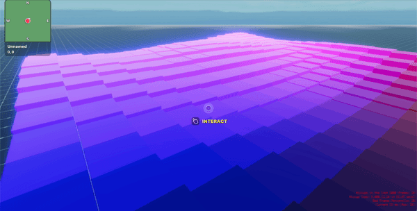

# Decentraland Noise Utils Library

This library includes tools for generating semi-random noise based on the Perlin and Simplex algorithms. These are used to generate random sequences of values that have a similarity to the kind of randomness we see in nature. The result is not chaotic noise, but rather smooth curves that trend up and down randomly, and always keeping a fairly even balance.

- [Background](#background)
- [Using the Noise Library](#using-the-noise-library)
- [Simplex](#simplex)
- [Perlin](#perlin)
- [Changes over time](#changes-over-time)
- [Full example](#full-example)
- [Pre-determined seeds](#follow-a-curved-path)

## Background

Both Simplex and Perlin Noise are algorithms that are commonly used in new-media art, games, and countless other applications to simulate a kind of randomness that seems natural, that transitions smoothly from one state to another.

Perlin Noise was developed in the 80s by Ken Perlin, then later in the early 2000s Ken Perlin himself also developed the Simplex Noise formula, which produces similar results but at less performance cost and with less artifacts. Aesthetic preference for one or the other is subjective, but in general Simplex is recommended for its lower performance cost.

Both algorithms are based on an n-dimensional grid of values. As we move along this grid in any of its dimensions, values slope up and down smoothly and randomly. We can choose to map these values to whatever we choose in our scenes to achieve a natural-looking kind of randomness. In this library, both algorithms have a 2 dimensional and a 3 dimensional version.


The results of these functions are not truly random, they follow a deterministic pattern. If you start from a fixed seed number, the results will always be the same. By default the library uses a random seed, which ensures that the result will be different every time and the formulas are designed to avoid any clear recognizable patterns.

## Using the Noise library

To use any of the helpers provided by the noise library

1. Install it as an `npm` package. Run this command in your scene's project folder:

```
npm install @dcl/noise-utils -B
```

2. Run `dcl start` or `dcl build` so the dependencies are correctly installed.

3. Import the library into the scene's script. Add this line at the start of your `game.ts` file, or any other TypeScript files that require it:

```ts
import { Noise } from '@dcl/noise-utils'
```

4. In your TypeScript file, write `Noise.` and let the suggestions of your IDE show the available helpers.

## Simplex

To use the 2d simplex formula, do `Noise.simplex2()`, to use the 3d simplex formula, do `Noise.simplex3()`.

The 2D version requires two parameters: an _x_ and a _y_ coordinate. The 3d version also requires a third parameter for th _z_ coordinate.

The functions return a single value, that represents a point in the grid system of the algorithm, at the 2d or 3d coordinates indicated in the input parameters.

The following function lays down a grid of cubes at random heights, following a 2d simplex formula so that they are shaped into smooth slopes.

```ts
for (var x = 0.5; x < 16; x++) {
  for (var y = 0.5; y < 16; y++) {
    let height = Noise.simplex2(x / 16, y / 16) + 1
    spawnCube(box, x, height, y)
  }
}
```

## Perlin

To use the 2d Perlin formula, do `Noise.perlin2()`, to use the 3d Perlin formula, do `Noise.perlin3()`.

The 2D version requires two parameters: an _x_ and a _y_ coordinate. The 3d version also requires a third parameter for th _z_ coordinate.

The functions return a single value, that represents a point in the grid system of the algorithm, at the 2d or 3d coordinates indicated in the input parameters.

The following function lays down a grid of cubes at random heights, following a 2d Perlin formula so that they are shaped into smooth slopes.

```ts
for (var x = 0.5; x < 16; x++) {
  for (var y = 0.5; y < 16; y++) {
    let height = Noise.perlin2(x / 16, y / 16) + 1
    spawnCube(box, x, height, y)
  }
}
```

## Changes over time

We can move over one of the dimensions of the grid system over time to mimic gradual random change.

The following example uses a 3d version of Perlin noise, using the first two dimensions for each position on the canvas, and the third dimension to changes over time.


## One dimensional noise

This library provides formulas for 2d and 3d noise. In some cases you may want to alter values based on a single parameter (like for example time). In those cases, you can simply use a 2d version of a function, setting a fixed constant value for one of the arguments.

## Full example

The following example uses a 3d simplex formula to map the heights of several cubes and move them up and down over time. The first two dimensions of the simplex formula relate to the gid positions of each cube, the third dimension advances over time to make these move like waves.



```ts
import { Noise } from '@dcl/noise-utils'

// --- Set up a system ---

class PerlinNoiseSystem implements ISystem {
  group: Entity[] = []
  active: boolean = false
  timer: number = 0
  update(dt: number) {
    this.timer += dt / 4

    // iterate over the entities of the group
    for (let entity of this.group) {
      // get the Transform component of the entity
      const transform = entity.getComponent(Transform)

      // set the height of the entity based on a simplex3 function, using its position on the grid and the time
      transform.position.y =
        Noise.simplex3(
          transform.position.x / 16,
          this.timer,
          transform.position.z / 16
        ) + 1
    }
  }
}

/// --- Spawner function ---
let noiseSystem = new PerlinNoiseSystem()

function spawnCube(box: Shape, x: number, y: number, z: number) {
  // create the entity
  const cube = new Entity()
  cube.addComponent(new Transform({ position: new Vector3(x, y, z) }))
  cube.addComponent(box)
  engine.addEntity(cube)

  let col = new Material()
  col.albedoColor = new Color3(x / 16, y / 16, z / 4)
  cube.addComponent(col)

  cube.addComponent(
    new OnClick(() => {
      if (!noiseSystem.active) {
        engine.addSystem(noiseSystem)
        noiseSystem.active = true
      } else {
        engine.removeSystem(noiseSystem)
        noiseSystem.active = false
      }
    })
  )

  noiseSystem.group.push(cube)

  return cube
}

/// --- Reusable box shape ---
let box = new BoxShape()

/// --- Spawn the cubes as a grid ---
for (var x = 0.5; x < 16; x++) {
  for (var y = 0.5; y < 16; y++) {
    let height = Noise.simplex3(x / 16, 0, y / 16) + 1
    spawnCube(box, x, height, y)
  }
}
```

> TIP: The speed of the passage of time can make a huge difference on how this effect looks. In this example we increment the time by _dt/4_ on every frame, which is approximately _0.00833_ (at 30 frames per second). Incrementing the value of the timer by _dt_ felt too fast for the desired effect here. Incrementing _1_ on every frame, it looked look chaotic, with no apparent relation between one frame and the next. We recommend you try different values till you find what looks right for what you're trying to achieve.

## Pre determined seeds

By default, the Perlin and simplex noise formulas use a random seed number, so that the result is always different and unpredictable.

For these formulas to always produce the same results, initiate the `Noise` object with a specific seed value. Use `Noise.Init(seed)`, where `seed` is a value between 0 and 1, or between 1 and 65536. After calling the `Init` object with a seed value, you can call the simplex or Perlin functions freely, and their results will be deterministic based on the seed you passed.

This is especially useful to make sure the result looks the same for all players who are in the scene at the same time. Consistency may be important in some cases, for example if the floor level raises players up or down randomly, you want players to all see the elevation patterns match the positions of other players. If all players have initiated their `Noise` object with the same seed value, then passing the same parameters to the Perlin or simplex functions should return the same values on each.
.


----


## Contribute

In order to test changes made to this repository in active scenes, do the following:

1. Run `npm run link` on this repository
2. On the scene directory, after you installed the dependency, run `npm link @dcl/ui-scene-utils`


## CI/CD

This repository uses `semantic-release` to atumatically release new versions of the package to NPM.

Use the following convention for commit names:

`feat: something`: Minor release, every time you add a feature or enhancement that doesn’t break the api.

`fix: something`: Bug fixing / patch

`chore: something`: Anything that doesn't require a release to npm, like changing the readme. Updating a dependency is **not** a chore if it fixes a bug or a vulnerability, that's a `fix`.

If you break the API of the library, you need to do a major release, and that's done a different way. You need to add a second comment that starts with `BREAKING CHANGE`, like:

```
commit -m "feat: changed the signature of a method" -m "BREAKING CHANGE: this commit breaks the API, changing foo(arg1) to foo(arg1, arg2)"
```